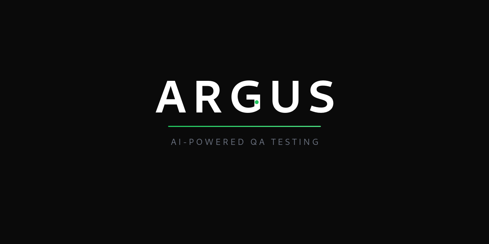
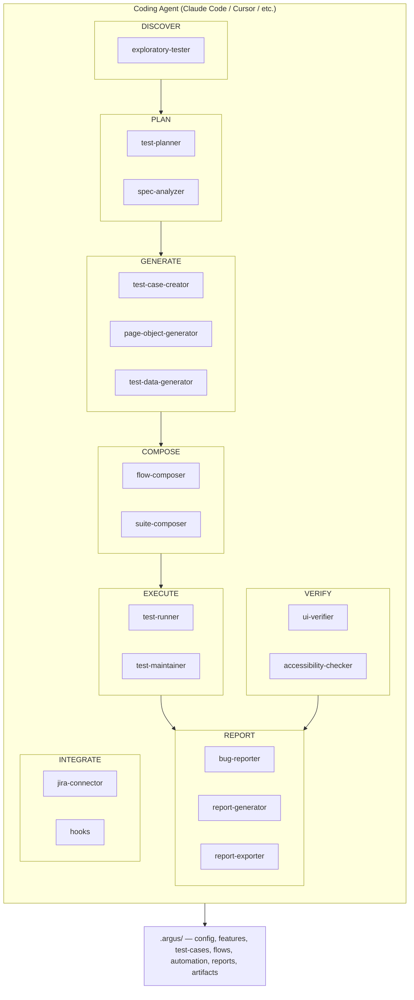

<p align="center">
  
</p>

# Argus — AI-Powered QA Testing Skills

> The 100-eyed watchman for your test automation.

Argus is a skill pack for coding agents (Claude Code, Cursor, etc.) that gives you AI-powered QA superpowers. Each skill handles a specific part of the testing lifecycle — from analyzing specs to generating test cases, page objects, E2E flows, and reports. AI proposes, you review and approve. Stack-agnostic: generates artifacts in your configured language and framework.

## Installation

**Via npx (recommended):**
```bash
npx skills add argus
```

**Via git clone:**
```bash
git clone https://github.com/darealvinz/argusQA.git
cd argus
./setup
```

## Quick Start

1. **Set up your project:** Tell the agent "Set up Argus for this project" — it walks you through config interactively
2. **Analyze a spec:** Paste a spec or ticket and say "Analyze this spec" — produces a structured feature file
3. **Generate test cases:** Say "Generate test cases for login" — produces comprehensive test cases across 5 layers

## Skills

| # | Skill | Phase | Description |
|---|-------|-------|-------------|
| 1 | `using-argus` | 1 | Meta skill — introduces Argus, guides setup |
| 2 | `test-planner` | 1 | Define test scope (browsers, devices, environments) |
| 3 | `spec-analyzer` | 1 | Analyze specs/tickets into structured feature files |
| 4 | `test-case-creator` | 1 | Generate test cases across UI, Functional, API, Security, Data layers |
| 5 | `page-object-generator` | 1 | Generate page objects and test specs for any framework |
| 6 | `flow-composer` | 1 | Chain features into end-to-end test flows |
| 7 | `test-data-generator` | 2 | Generate realistic test data |
| 8 | `suite-composer` | 2 | Build test suites (smoke, sanity, regression, full) |
| 9 | `test-runner` | 2 | Execute automation tests with traceability |
| 10 | `bug-reporter` | 2 | Draft bug tickets from test failures |
| 11 | `report-generator` | 2 | Sprint, feature, daily, and release readiness reports |
| 12 | `jira-connector` | 2 | Pull tickets from Jira |
| 13 | `exploratory-tester` | 3 | Explore an app to understand flows |
| 14 | `ui-verifier` | 3 | Compare designs against live app |
| 15 | `accessibility-checker` | 3 | WCAG compliance checks |
| 16 | `report-exporter` | 3 | Export test cases to Excel, discovery/bug reports to styled HTML |

## Supported Stacks

| Component | Options |
|-----------|---------|
| Language | TypeScript, JavaScript, Python, Java |
| Web Framework | Playwright, Cypress, Selenium |
| Mobile Framework | WebdriverIO, Detox |
| API Approach | Native fetch, Supertest, Axios, Rest Assured |
| Test Runner | Vitest, Jest, Pytest, JUnit |

## Phase Roadmap

- **Phase 1**: Core skills — test planning, spec analysis, test case generation, page object generation, flow composition
- **Phase 2**: Integration & execution — test data, suites, runner, bug reporting, reports, Jira
- **Phase 3** (current): Discovery & verification — exploratory testing, UI verification, accessibility, test maintenance, artifact export

## Project Structure

```
argus/
├── config/            # Example config for project setup
├── schemas/           # Artifact format definitions
├── examples/          # Example artifacts for reference
├── skills/            # Skill files (SKILL.md per skill)
├── scripts/           # Reusable export scripts (xlsx generation)
├── hooks/             # Agent hook definitions
├── setup              # Setup script for git clone installs
└── package.json       # Package metadata
```

Each project using Argus has a `.argus/` directory:

```
.argus/
├── config.yaml        # Project configuration
├── features/          # Analyzed feature files
├── test-cases/        # Generated test cases
├── flows/             # E2E flow definitions
├── automation/        # Generated page objects and specs
├── reports/           # All reports
└── artifacts/         # Exported HTML and Excel files
```

## Key Principles

1. **Human-in-the-loop** — Every skill pauses for your review. AI proposes, you approve.
2. **Spec is truth** — Tests are written against requirements, not code.
3. **Stack-agnostic** — Skills generate code in your configured framework.
4. **Layered testing** — 5 layers (UI, Functional, API, Security, Data). AI proposes relevant layers, you confirm.

## Architecture



**Flow:** Spec → Feature File → Test Cases → Page Objects → Flows → Suites → Execution → Reports

At every step, the AI proposes and you review before proceeding.

## Contributing

Contributions welcome! Please read the spec before submitting PRs. Open an issue to discuss new skills or changes.

## License

MIT
